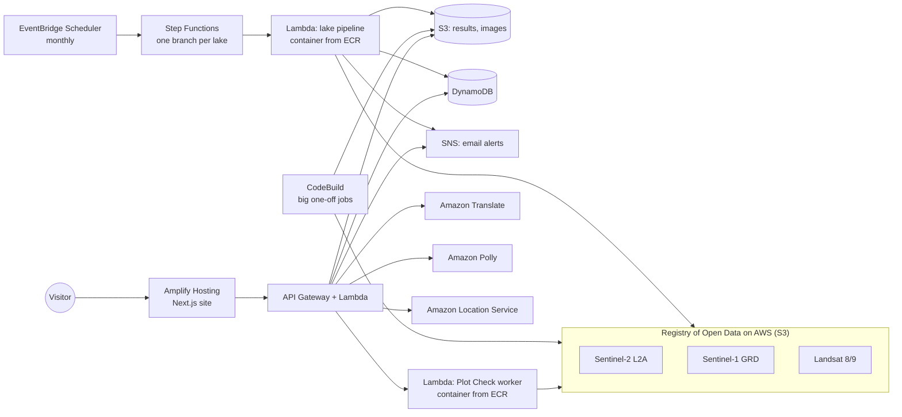

# How JalRekha uses AWS

JalRekha reads free satellite photos where they already sit on AWS, analyses one lake, plot or pond per run, and serves the results to a static website. Nothing runs all the time: every piece starts when it's needed and stops when it's done.

Everything runs in **us-west-2 (Oregon)**, the region where the Sentinel-2 archive is stored, so the photos never leave the region and we pay nothing to move them.

## The big picture



## Services, and what each one does

| Service | What JalRekha uses it for |
| --- | --- |
| **Registry of Open Data on AWS** | Sentinel-2 (water and land, 10 m), Sentinel-1 radar (floods, sees through cloud) and Landsat 8/9 (summer ground heat), read in place from S3 |
| **AWS Lambda** (container images) | The lake pipeline; the Plot Check, "Track this lake" and pond-check worker. One run each |
| **Amazon ECR** | Holds those container images (scan on push, old images expire) |
| **AWS Step Functions** | Runs every lake side by side, with retries |
| **Amazon EventBridge Scheduler** | Starts a re-scan of every lake each month |
| **Amazon S3** | Results, before-and-after photos, flags, pond data and Jal's recorded voice. Private, served through short-lived links |
| **Amazon DynamoDB** | Lake summaries and flags, Plot Check runs and their live progress, pond cases, saved translations, alert subscribers |
| **Amazon SNS** | One email to the people watching a lake when a new change appears |
| **Amazon API Gateway** + **Lambda** | The website's API: lake results, Plot Check, pond cases, alerts, translation, voice |
| **Amazon Location Service** | Address and landmark search for Plot Check, limited to India |
| **Amazon Translate** | The whole site and every Plot Check answer in Hindi, Kannada and Telugu |
| **Amazon Polly** | Jal's voice (Indian English and Hindi), reading each part of the page aloud |
| **AWS CodeBuild** | Jobs too big for Lambda (the whole-Delhi pond scan, flood maps, batches of lakes), plus container builds and tests |
| **AWS Amplify Hosting** | The website. A push to GitHub rebuilds it and puts it live |
| **Amazon CloudWatch** | Logs for every Lambda and CodeBuild run |
| **IAM** and **AWS Budgets** | One least-privilege role per piece; a $10 monthly budget with email warnings |

## 1. The satellite photos: Registry of Open Data

We never download or store the satellite archive. Each run looks up the photos for one lake in the Earth Search catalogue, then reads only the small window around that lake straight from the public S3 buckets:

- **Sentinel-2 L2A**, every summer since 2019: where water turned into land.
- **Sentinel-1 GRD** (radar): where past floods spread, since radar sees through monsoon cloud.
- **Landsat 8/9 Collection 2 Level-2**: how hot the ground gets in April and May, so we can compare the lake with filled lake bed nearby.

Because the code runs in the same region as the data, reading it is fast and costs nothing to transfer.

## 2. Checking every lake: Step Functions, Lambda and EventBridge

**Code:** [`infra/lambda/`](../infra/lambda/), [`infra/stepfunctions/`](../infra/stepfunctions/)

1. **EventBridge Scheduler** (`kerewatch-monthly-rescan`) starts the state machine at 03:00 IST on the 5th of each month.
2. **Step Functions** (`kerewatch-run-all`) uses a Map state with one branch per lake, up to 6 at a time. Each branch retries on throttling or timeouts. If one lake fails, it's caught and the other lakes carry on.
3. Each branch calls the **pipeline Lambda** (`kerewatch-pipeline`). It's a container image from **ECR**, because GDAL and rasterio are far too big for a normal Lambda zip. It has 3 GB of memory and a 15-minute limit, and one lake takes about 105 seconds.
4. The Lambda writes the lake's results to **S3**: statistics, flags, outlines, and before-and-after images for every season.
5. It also writes them to **DynamoDB** (`kerewatch-lakes`): one item for the lake summary, one per season and one per flag.
6. If a *newly processed* dry season brings new flags, the Lambda publishes once to **SNS** (`kerewatch-alerts`). Each subscriber has a filter policy on the lake id, so people only get email about the lake they watch. Monthly re-scans of the same season don't send the same alert again.

## 3. The website's API: API Gateway and Lambda

**Code:** [`infra/api/handler.py`](../infra/api/handler.py), [`infra/plot/api.py`](../infra/plot/api.py)

The site is a static Next.js export on **Amplify Hosting**. Everything live comes from **API Gateway HTTP APIs** backed by small zip Lambdas:

- **`GET /index.json`** builds the lake list from each lake's `summary.json` in S3.
- **`GET /lakes/<id>/<file>`** answers with a 302 redirect to a **presigned S3 link** that expires shortly. The buckets block all public access, so files are only ever served through these links.
- **`POST /watch`** and **`POST /unwatch`** store the subscriber in DynamoDB (`kerewatch-watchers`) and subscribe them to SNS. SNS then sends its own confirmation email, so nobody gets alerts they didn't confirm.

## 4. Plot Check and "Track this lake": a worker that reports its progress

**Code:** [`infra/plot/`](../infra/plot/)

A Plot Check takes about two minutes, but API Gateway gives up after 30 seconds. So the work is split in two:

1. **`POST /check`** saves a DynamoDB item and invokes the **worker Lambda** asynchronously, then returns straight away. The worker is another ECR container.
2. The worker reads the satellite history of that pin. After each step (finding the spot, reading every photo, finding water, checking flood maps, writing the report), it updates the DynamoDB item.
3. The page polls **`GET /check/<id>`** every few seconds, so visitors watch Jal work through the steps instead of a frozen screen.
4. Images go to S3, and the finished report is stored in DynamoDB, so the API can answer without reading S3.

The same pattern runs **"Track this lake"** (the full lake analysis for any catalogued lake, on demand) and **pond checks** (is there water in an adopted pond now?). A pin is rounded to about 11 m, so a spot is analysed once and the result is shared. It's re-run after 30 days, once new photos exist.

## 5. Every language, and Jal's voice: Translate and Polly

- **Amazon Translate** (`POST /translate`) turns the site's text and every Plot Check answer into हिन्दी, ಕನ್ನಡ and తెలుగు. Each phrase is translated once and saved in DynamoDB, so the next visitor gets it instantly at no cost.
- **Amazon Polly** (`POST /speak`) gives Jal a voice: Kajal, an Indian voice, in English and Hindi. Each clip is made once, saved in S3 and played from a presigned link after that.

## 6. Address search: Amazon Location Service

Plot Check's search box (`GET /geocode`) uses Amazon Location Service Places. It searches landmarks first (lakes, layouts, apartment blocks), then street addresses, limited to India and shown with India's political view.

## 7. Big jobs: CodeBuild

**Code:** [`infra/plot/codebuild.sh`](../infra/plot/codebuild.sh), [`infra/plot/buildspec.yml`](../infra/plot/buildspec.yml)

Some jobs don't fit Lambda's 15-minute limit. One CodeBuild project (`jalrekha-build`) runs them on demand, with a `MODE` that picks the job:

| `MODE` | Job |
| --- | --- |
| `ponds` | Every pond in Delhi from space, and which ones have dried up (a 5,000 × 5,300 pixel grid over seven years, about 15 minutes) |
| `flood` | A Sentinel-1 flood map for a past flood (Bengaluru 2022, Chennai 2015, Delhi 2023, Hyderabad 2020) |
| `lakes` | The lake pipeline for a batch of lakes at once |
| `story` | The photos for each lake's step-by-step story |
| `image` | Build the worker container, push it to ECR and point the Lambda at it |
| `test` | The pipeline's test suite |

Each job runs on a large machine, saves its results to S3 and switches off.

## 8. Plain-language explanations: Amazon Bedrock (not live yet)

Plot Check's verdict level (high / watch / low) comes from a fixed rule, so the same spot always gets the same answer. The explanation is meant to come from **Claude on Amazon Bedrock**, written from the satellite facts ([`pipeline/jalrekha/verdict.py`](../pipeline/jalrekha/verdict.py)).

Our Bedrock model access is still pending. Until it's granted, the code uses an English template translated by Amazon Translate, or fixed templates written in each language. The live site works either way.

## Security and cost

- **Private by default:** every bucket blocks public access and uses server-side encryption. Files are only served through presigned links that expire.
- **Least privilege:** each Lambda, the state machine, the scheduler and CodeBuild has its own IAM role, allowed only what it needs. The policies are in [`infra/iam/`](../infra/iam/) and [`infra/plot/iam/`](../infra/plot/iam/).
- **Nothing idle:** Lambda, Step Functions, CodeBuild and DynamoDB (on-demand) only cost money while they run. The satellite data is free to read.
- **Caching:** translations, voice clips and finished checks are saved and reused, so repeat visits don't call Translate, Polly or the worker again.
- **Guard rails:**
  - A $10/month AWS Budget emails us at 50% and 100%.
  - ECR keeps only the newest few images.
  - Uploaded source code in S3 expires after 7 days.
  - Every resource is tagged by project.

## Two AWS accounts

Our team split the work across two accounts, both in us-west-2:

| Account | What's in it | Set up by |
| --- | --- | --- |
| Lake pipeline | Pipeline Lambda, Step Functions, EventBridge Scheduler, SNS alerts, `kerewatch-*` S3 and DynamoDB, Amplify Hosting | [`infra/README.md`](../infra/README.md) |
| Plot Check | The API the site reads lake results from, Plot Check, Track this lake, ponds, Translate, Polly, Location Service, CodeBuild | [`infra/plot/setup.sh`](../infra/plot/setup.sh) |

The live site reads lake results, Plot Check, translation and voice from the Plot Check API, and sends alert sign-ups to the lake pipeline's API. [`infra/plot/mirror_results.py`](../infra/plot/mirror_results.py) copied the first 13 lakes' results across, so one API serves all 27 tracked lakes.

The deployed resources keep their original `kerewatch-*` names from before the project was renamed JalRekha.

## Problems we hit, and how we fixed them

| Problem | Fix |
| --- | --- |
| GDAL and rasterio are too big for a Lambda zip | Package the analysis as a container image in ECR |
| A Plot Check takes 2 minutes; API Gateway waits 30 seconds | Invoke the worker asynchronously, save progress to DynamoDB and poll it |
| Scanning all of Delhi is longer than Lambda's 15-minute limit | Run it as a CodeBuild job |
| Presigned links to S3's global address redirect, and the redirect fails CORS on the map | Sign links against the regional S3 address |
| Two overlapping container deploys left the worker on an old image | Deploy one at a time, then check that the Lambda's image matches the newest one in ECR |
| Windows line endings broke shell scripts in CodeBuild | A `.gitattributes` rule keeps scripts in Linux format |

## Try it yourself

```bash
# Run every lake now (lake pipeline account)
aws stepfunctions start-execution --region us-west-2 \
  --state-machine-arn arn:aws:states:us-west-2:<account>:stateMachine:kerewatch-run-all \
  --input file://infra/stepfunctions/input.example.json

# Set up the Plot Check stack in a fresh account
bash infra/plot/setup.sh base      # S3, DynamoDB, ECR, IAM roles, CodeBuild project
bash infra/plot/setup.sh build image
bash infra/plot/setup.sh lambdas   # worker + API Lambdas, HTTP API
```

For full setup steps, see [`infra/README.md`](../infra/README.md).
